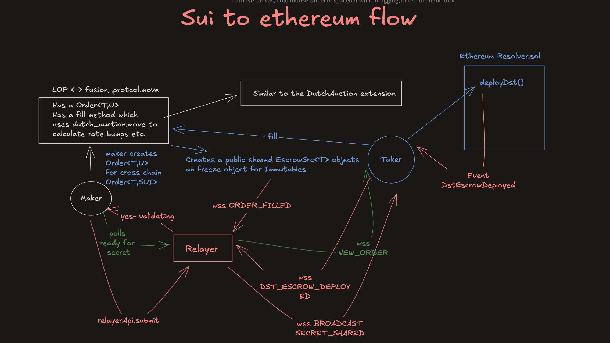

# SuiFusion

Sui Fusion extends 1inch Fusion+ protocol to SUI. What sets SuiFusion apart from others is that it is fully working deployed with UI, has test for every case of the step for 1inch Fusion+ Swaps like private and public withdraws,cancel etc.. The move contracts respect HLTL logic and also the dutch auction extension is implemented. SuiFusion Extends the current `@1inch/cross-chain-sdk` and adds Sui Primitives to it. It comes with a fully working resolver backend, a relayer which communicates through a websocket stream. It is also shipped with a basic qouter.

## A End 2 End Workings Example

For demo purposes the ethereum address for the maker is hardcoded because of tenderly limitations.
This is the proof for a working example with the UI. Every thing is done is less than 30 seconds on the deployed website. The user wants to swap 2 USDC the qouter always returns a static rate bump of initial *86349* in 10**7 basis so he should recieve something like 2 * 1.0086349 which should be 2.0172698 which is the amount.

A user wants swap 2 SUI to WETH, he gets a qoute for 0.001945 WETH, so with the rate bump he should get something greater than 0.001945 * 1.0086349 = 0.00197 which is the amount seen in the end of the video thus onchain auction is working correctly
<div style="display: flex; gap: 16px;">
   <div style="display: flex; flex-direction: column; align-items: center;">
      <span><strong>EVM to SUI</strong></span>
      <source src="./evm-to-sui.mp4" height="300" width="300" controls type="video/mp4"></video>
   </div>
   <b></b>
   <div style="display: flex; flex-direction: column; align-items: center;">
      <span><strong>SUI to EVM</strong></span>
      <source src="./sui-to-evm.mp4" height="300" width="300" controls type="video/mp4"></video>
   </div>
</div>

## Tests

There is an intensive test suite for validity of the dutch auction and things like protocol timings and more in [tests](./fusion_plus_contracts/tests/). You can run them via:
`sui move test`

## Move Contracts Architecture

The SuiFusionprotocol consists of several interconnected Move contracts that implement the 1inch Fusion+ protocol on Sui. The whole architecture is based on generics. The is the Sui to Evm flow:


Every things is done with a thought the created Order is a public shared object on sui as anyone should be able to call fill on it. The escrow objects are also a public shared object so anyone could call public withdraw, public cancel on the escrow and the immutables as name says we have a public freeze project. A on chain dutch auction also takes place

### Core Contracts

1. [**fusion_protocol.move**](./fusion_plus_contracts/sources/fusion_protocol.move) - The main protocol contract that orchestrates cross-chain swaps

   **Key Structs:**
   - `Order<T, U>` - Core order structure containing maker assets, auction data, and cross-chain metadata. It is a generic over two vars of Maker token and taker token, the taker token is `option<U>` because we may not need the taker token in case of fill on an order which is cross chain

   **Main Functions:**
   - `create_order<T,U>()` - Creates order objects with validation
   - `create_cross_chain_order<T>()` - Specialized function for cross-chain orders
   - `fill<T, U>()` - Core fill function for order execution
   - `fill_cross_chain_order<T>()` - freindly wrapper aroound cross-chain order fills
   - `get_taker_amount()` - Calculates taker amount using Dutch auction
   - `get_fee_amounts()` - Computes protocol and integrator fees
   - `order_hash<T, U>()` - Generates unique order hash

2. [**escrow_src.move**](./fusion_plus_contracts/sources/escrow_src.move) - Source chain escrow contract

   **Key Structs:**
   - `FusionPlusSrcEscrow<T>` - Source escrow holding tokens and safety deposit with immutables hash

   **Main Functions:**
   - `create_src_escrow<T>()` - Creates source escrow (package-only function) as it is only allowed to be called by `fill`.
   - `withdraw_to<T>()` - Private withdrawal with secret reveal
   - `public_withdraw<T>()` - Public withdrawal after timeout
   - `resolver_cancel<T>()` - Resolver-initiated cancellation
   - `public_cancel<T>()` - Public cancellation after final timeout
   - `token_value<T>()` - Gets locked token amount
   - `immutables_hash<T>()` - Returns immutables hash for validation

3. **escrow_dst.move** - Destination chain escrow contract

   **Key Structs:**
   - `FusionPlusDstEscrow<T>` - Destination escrow with tokens, safety deposit, and taker info
   - `SuiDstImmutables` - Destination chain immutable parameters

   **Main Functions:**
   - `create_dst_escrow<T>()` - Creates destination escrow with validation
   - `from_bytes()` - Deserializes immutables from bytes
   - `resolver_withdraw<T>()` - Resolver withdrawal with secret
   - `public_withdraw<T>()` - Public withdrawal mechanism
   - `cancel<T>()` - Cancellation after timeout
   - `valid_secret()` - Validates secret against hash lock
   - `hash()` - Generates immutables hash

4. **dutch_auction.move** - Dutch auction mechanism

   **Key Structs:**
   - `AuctionData` - Contains start time, duration, initial rate bump, and point deltas
   - `PointAndTimeDelta` - Rate bump and time delta pairs for auction curves

   **Main Functions:**
   - `calculate_rate_bump()` - Calculates current rate bump based on time
   - `calculate_premium()` - Computes cancellation premium over time
   - `create_auction_data()` - Constructs auction data structure
   - `from_bytes()` - Deserializes auction data from bytes

5. **time_lock.move** - Time-based locking utilities

   **Key Structs:**
   - `TimeLock` - Contains packed timing data for all stages
   - `Stage` - Enum defining 7 stages of the protocol lifecycle

   **Main Functions:**
   - `create_timelock()` - Creates timelock with packed timing data
   - `set_deployed_at()` - Sets deployment timestamp
   - `get()` - Retrieves timing for specific stage
   - `rescue_start()` - Calculates rescue start time
   - `stage()` - Converts number to Stage enum

6. **immutables.move** - Immutable configuration and constants

   **Key Structs:**
   - `Immutables` - Core immutable data for source chain operations
   - `ExtraData` - Cross-chain specific data (hash lock, destination chain info)
   - `DstImmutables` - Destination chain immutable parameters

   **Main Functions:**
   - `create_immutables()` - Creates immutable object for source chain
   - `create_dst_immutables()` - Creates destination chain immutables
   - `extra_data_from_bytes()` - Deserializes extra data
   - `hash()` - Generates immutables hash for validation
   - `valid_secret()` - Validates secret against hash lock
   - `only_after()` / `only_before()` - Time-based access control
   - `only_taker()` - Taker-only access control

7. **traits.move** - Common interfaces and traits

   **Main Functions:**
   - `is_allowed_sender()` - Validates sender permissions
   - `get_expiration_time()` / `is_expired()` - Expiration handling
   - `allow_partial_fills()` / `allow_multiple_fills()` - Fill permissions
   - `use_bit_invalidator()` - Determines invalidation method
   - `is_making_amount()` - Checks if amount is maker amount
   - `threshold()` - Gets threshold amount from taker traits
   - `args_has_target()` - Checks for target in arguments

8. **arithmetic.move** - Mathematical utilities

   **Main Functions:**
   - `mul_div_floor()` - Multiplication with division rounded down
   - `mul_div_ceil()` - Multiplication with division rounded up

### Key Features

- **HTLC Implementation**: Full Hash Time Locked Contract support for secure cross-chain transfers
- **Dutch Auction Extension**: Advanced price discovery mechanism
- **Private/Public Withdrawals**: Flexible withdrawal options for different use cases
- **Comprehensive Testing**: Full test coverage for all swap scenarios including cancellations

## Changes made to `@1inch/cross-chain-sdk`

Changes made to sdk can be found at my fork commmit [here](https://github.com/0xnullifier/cross-chain-sdk/commit/aaff1eee0a02ca6b65dabf4d3a463abcb109f7ed)

Here are the most meaningful ones:

### 1. Sui Address Integrations [`src/domains`](https://github.com/0xnullifier/cross-chain-sdk/commit/aaff1eee0a02ca6b65dabf4d3a463abcb109f7ed#diff-0b38b00f6f14b3c6393a5fcb1eaa72a2f7a62ab150945c822760f2f8d3508073)

- **SuiAddress class**: Added comprehensive Sui address handling
  - Create a special internal token
  - Automatic validation and normalization
  - Seamless integration with existing domain architecture for examples the `Qouter` and more!

### 2. Cross-Chain Order Extensions [`src/cross-chain-order/`](https://github.com/0xnullifier/cross-chain-sdk/commit/aaff1eee0a02ca6b65dabf4d3a463abcb109f7ed#diff-e329e3863c45571bc189495efb64d56435272cfa8212dc4e1f14d10a2869bf56)

- **Sui Order Types**: Extended order structures for Sui-specific requirements
- **Move Contract Integration**: Added support for Move contract interactions
- **Sui Transaction Building**: Native Sui transaction construction and signing

### 3. Freindly Contract Interfaces for resolvers in [`src/contracts`](https://github.com/0xnullifier/cross-chain-sdk/commit/aaff1eee0a02ca6b65dabf4d3a463abcb109f7ed#diff-032ace5c91958797130cb9bc6f38dc8fc6809a8b4d5c52602eb11bd2903dd74c)

Maket the qouter api integrate for Sui

These changes make the SDK fully compatible with Sui while maintaining backward compatibility with existing EVM chains, enabling true cross-chain functionality between Sui and EVM ecosystems.

## Getting Started

```bash
git clone https://github.com/0xnullifier/SuiFusion.git
```

```bash
pnpm start:qouter
```

```bash
pnpm start:relayer
```

```bash
pnpm start:resolver-backend
```

For Sui to evm: `pnpm start:sui-to-evm`
For evm to sui: `pnpm start:evm-to-sui`
